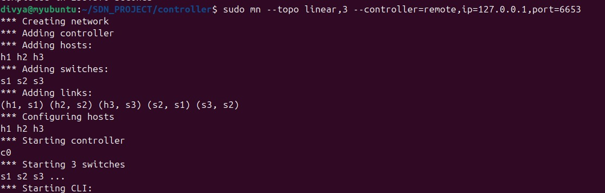
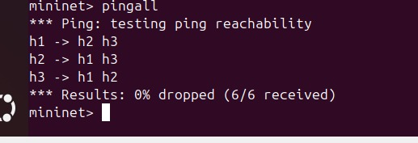
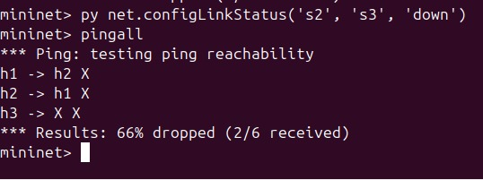

# 🔗 SDN Project: Multi-Switch Flow Table Analyzer using Ryu Controller

## 📌 Project Overview

This project demonstrates the behavior of a Software Defined Network (SDN) using a multi-switch topology.

The controller dynamically analyzes traffic and installs flow rules using OpenFlow.

The network is tested under:
- Normal conditions
- Link failure
- Link recovery

Verification tools:
- Mininet
- ovs-ofctl
- Wireshark
- iperf

---

## 🌐 Network Topology

```text
        h1        h2        h3
         |         |         |
        s1 ------- s2 ------- s3
```

### Description
- Switches: s1, s2, s3
- Hosts: h1, h2, h3
- Failure link: s2 — s3

## ⚙️ Requirements
- Ubuntu (20.04 / 22.04)
- Mininet
- Docker
- Ryu Controller
- Wireshark

## 🚀 Execution Steps
### STEP 1 — Start Controller (Terminal 1)

```bash
sudo mn -c
sudo docker rm -f $(docker ps -aq) 2>/dev/null
```

```bash
cd ~/SDN_CN_PROJECT/controller

sudo docker run -it --rm --network host \
-v $(pwd):/app \
-w /app \
-e PYTHONPATH=/app \
osrg/ryu \
ryu-manager flowanalyser.py
```
### STEP 2 — Start Mininet (Terminal 2)

```bash
sudo mn --topo linear,3 --controller=remote,ip=127.0.0.1,port=6653
```

Expected:

```bash
mininet>
```

## 🧪 Testing

### Normal Connectivity

```bash
pingall
```

Expected:

```bash
0% packet loss
```

### Link Failure

```bash
py net.configLinkStatus('s2','s3','down')
pingall
```

Expected:

- Partial packet loss
- h3 becomes unreachable

### Link Recovery

```bash
py net.configLinkStatus('s2','s3','up')
pingall
```

Expected:

```bash
0% packet loss
```

## 🔍 Flow Table Verification

```bash
sh ovs-ofctl dump-flows s1
sh ovs-ofctl dump-flows s2
sh ovs-ofctl dump-flows s3
```

Expected:

```bash
priority=1 actions=output:...
priority=0 actions=CONTROLLER
```

## 📡 Wireshark Analysis

```bash
sudo wireshark
```

Select interface:
```bash
lo
```

Generate traffic:

```bash
h1 ping -c 5 h3
```

Apply filter:

```bash
openflow
```
Expected:

- OFPT_PACKET_IN
- OFPT_PACKET_OUT
- OFPT_ECHO

## 📈 Throughput Analysis (iperf)
### Normal

```bash
h1 iperf -s &
h3 iperf -c h1
```

### Failure

```bash
py net.configLinkStatus('s2','s3','down')
h3 iperf -c h1
```

Expected:
```bash
Connection failed
```

### Recovery

```bash
py net.configLinkStatus('s2','s3','up')
h3 iperf -c h1
```

## 📊 Performance Summary

| Scenario | Packet Loss | Throughput |
|----------|------------|-----------|
| Normal   | 0%         | High      |
| Failure  | Partial    | Fails     |
| Recovery | 0%         | Restored  |


## 🎯 Key Concept

### Reactive SDN:

- Controller installs flows dynamically
- Packet arrival triggers flow rules
- No pre-defined routing

## 📁 Project Structure

```bash
SDN_CN_PROJECT/
 ├── controller/
 │   └── flowanalyser.py
 ├── screenshots/
 └── README.md
```

## 📸 Results





## 🧾 Conclusion

This project demonstrates:

- Multi-switch SDN behavior
- Dynamic flow installation
- Network recovery after link failure

## 👤 Author

Tanvi Magalur
